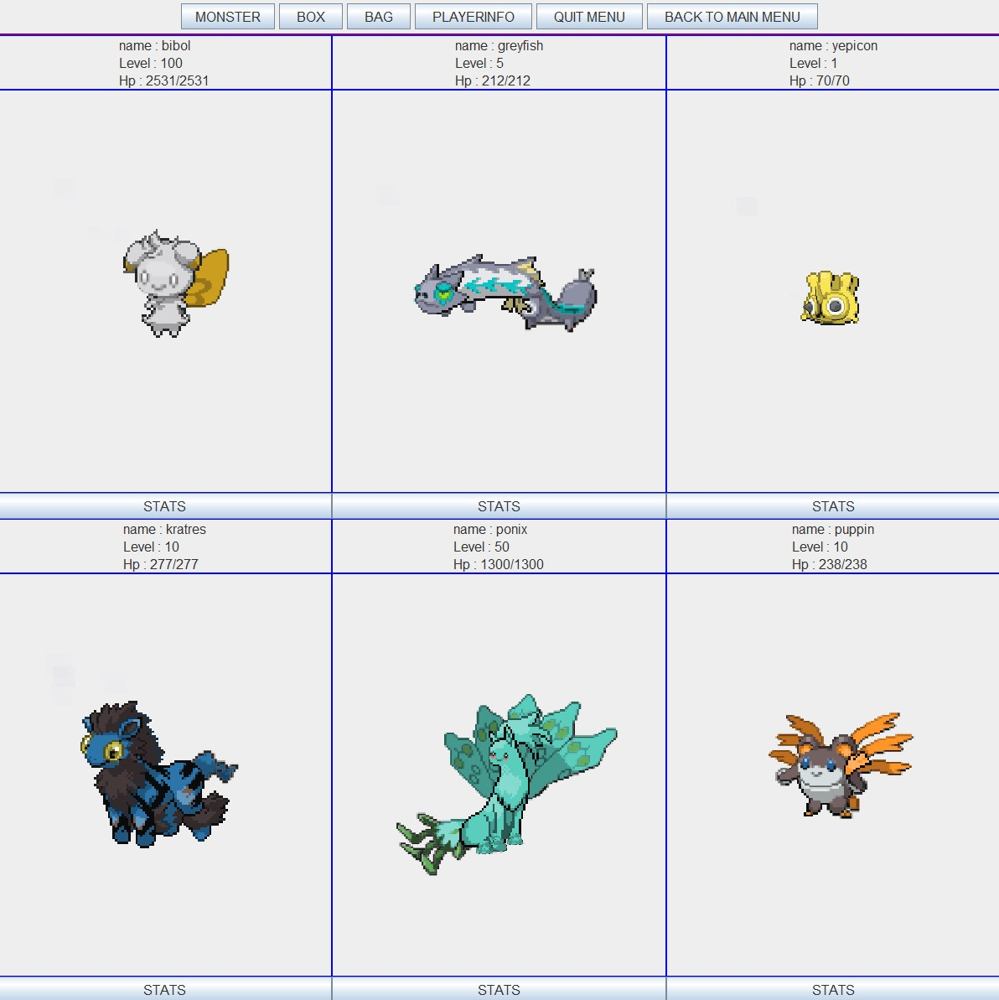

# OOP20-pokaiju

## Description
This is a universitary project developed for the OOP course by: Barattini Luca, Carafassi Samuele, Castorina Andrea, Guo Jia Hao, Pierantoni Michael.
It's a game inspired to the famous game series "Pokemon".

## Commands
- W : move up
- A : move left
- S : move down
- D : move right
- Z : interaction command
- X : open game menu

## Gameplay

Capture many monsters and make your team.
_____________________________________________________
  

Challenge new enemies talking with trainers or walking in the wild grass. Make your monsters level up so they can evolve and get stronger.
_____________________________________________________
  

Use the box when your team is full. Deposit the monster in your team, withdraw the ones in the boxes or exchange to do both at once.
_____________________________________________________
  

Buy items from the merchant, the business man.
